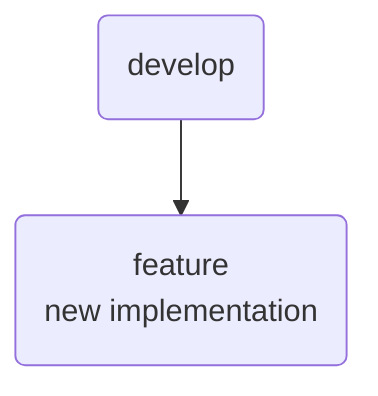
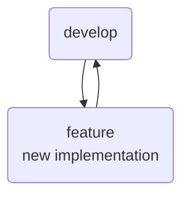
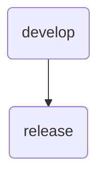
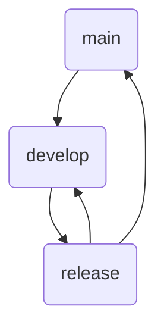
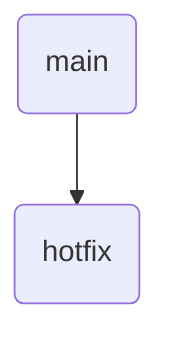
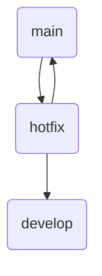

# Relatório de Estudos

**Nome do Estagiário:** Gabriel Alvim  
**Data:** 06/08/2024
#

## Git 

Git é um sistema de controle de versão distribuído amplamente utilizado para rastrear alterações em arquivos e coordenar o trabalho de várias pessoas em projetos de desenvolvimento de software. Git permite que desenvolvedores colaborem de forma eficiente e segura.

## Resumo dos módulos 

Ao explorar a trilha de Git, aprendi diversos conceitos fundamentais para o controle de versão e a colaboração eficiente em projetos de software. Compreendi que Git é um sistema de controle de versão distribuído, que permite rastrear alterações em arquivos e coordenar o trabalho de várias pessoas. Aprendi a utilizar repositórios, commits, branches, merges, pulls, pushes, clones e forks para gerenciar e sincronizar meu trabalho com outros desenvolvedores.

## Principais Conceitos do Git

- **Repositório (Repo)**: Aprendi que é um diretório onde o Git armazena o histórico completo de mudanças do projeto.

- **Commit**: Entendi que cada commit representa um snapshot do projeto em um ponto específico no tempo, com um identificador único (hash).
- **Branch**: Usei branches para trabalhar em diferentes linhas de desenvolvimento ao mesmo tempo, com a branch principal geralmente sendo chamada de "main" ou "master".
- **Merge**: Combinei mudanças de diferentes branches em uma única branch.
- **Pull**: Atualizei a cópia local do repositório com as mudanças mais recentes do repositório remoto.
- **Push**: Enviei as mudanças locais para o repositório remoto.
- **Clone**: Criei cópias locais de repositórios remotos.
- **Fork**: Criei cópias independentes de repositórios para contribuir com projetos sem afetar os originais.
([acesso ao fork realizado](https://github.com/GBAlvim/lsilva))

Demais comandos foram realizados congruentemente via estágio, entre projetos passados e em aula. [Acesso GitHub](https://github.com/GBAlvim)

## Recursos Utilizados:
- [Alura](https://www.alura.com.br/artigos/git-flow-o-que-e-como-quando-utilizar)
- [GitHub](https://github.com/nvie/gitflow)
- [Coursera](https://www.udemy.com/course/git-e-github-para-iniciantes/learn/lecture/5120538?start=0#overview)
- [Web](https://danielkummer.github.io/git-flow-cheatsheet/)
- [Git (pdf)](https://git-scm.com/book/en/v2)

## Introdução ao GitFlow
Com GitFlow, entendi como gerenciar branches de forma organizada e eficiente em projetos colaborativos de larga escala. Aprendi que o GitFlow define um conjunto de procedimentos para gerenciar diferentes tipos de branches.

### Branches Principais:

- **main**: Contém o código de produção estável.
- **develop**: Contém o código em desenvolvimento com as últimas alterações aprovadas.

### Branches de Suporte:

- **feature**: Usada para desenvolver novas funcionalidades.
- **release**: Preparada para o lançamento de uma nova versão, derivando da *develop* e, após ajustes finais, sendo mesclada na *main* e *develop*.
- **hotfix**: Criada para correções urgentes em produção, derivando da *main* e sendo mesclada de volta na *main* e *develop* após a correção.

## Fluxo de Trabalho:
### Criando uma branch feature a partir da develop

**Adicionando a funcionalidade ao projeto**

### Criando uma branch release a partir da develop

**Efetuando os ajustes finais e correções**

### Criando uma branch hotfix a partir da main

**Efetuando a correção necessária**

*Nota*:
toda alteração, implementação e/ou correção quando commitada de uma branch para outra branch a qual não seja derivada, é necessário fazer um *Pull request*.
#
**Desafios Encontrados:**  
O desafio que encontrei foi em relação a execução dos comandos, pois ainda não utilizo todos com frequência.

**Feedback e Ajustes:**  
Com essa trilha de Git e GitFlow, adquiri uma compreensão aprofundada das ferramentas e práticas necessárias para um desenvolvimento de software eficiente e colaborativo.

**Próximos Passos:**  
Compreender e fortificar meu conhecimento dos conceitos e comandos, utilizando-os com frequência.
