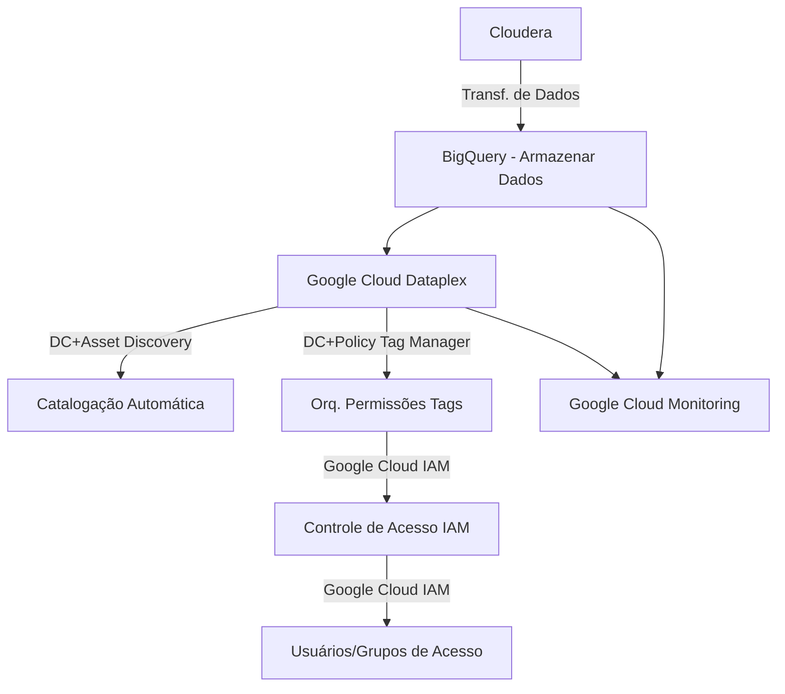

# Relatório de Estudos
**Nome do Estagiário:** Gabriel Alvim  
**Data:** 11/09/2024
#
# Governança de Dados
A governança de dados refere-se ao conjunto de práticas, políticas e processos que garantem a gestão adequada dos dados dentro de uma organização. O objetivo é assegurar que os dados sejam precisos, acessíveis, seguros e usados de maneira eficiente e ética. Sendo crucial para assegurar que os dados sejam geridos de forma eficaz e que contribuam para os objetivos estratégicos da organização, ao mesmo tempo que mitigam riscos e garantem conformidade com as normas e regulamentações aplicáveis

## DAMA (Governança de Dados)

- **Qualidade dos Dados**: Estabelecer padrões e processos para garantir que os dados sejam precisos, completos e confiáveis.

- **Segurança dos Dados**: Implementar medidas para proteger os dados contra acesso não autorizado, perda ou vazamentos. Isso inclui controles de acesso, criptografia e políticas de privacidade.

- **Compliance e Regulamentação**: Garantir que a gestão de dados esteja em conformidade com leis e regulamentos, como o GDPR na União Europeia ou a LGPD no Brasil.

- **Estrutura e Responsabilidade**: Definir papéis e responsabilidades claros para a gestão dos dados dentro da organização. Isso pode incluir a nomeação de um Chief Data Officer (CDO) ou a formação de comitês de governança.

- **Armazenamento e Arquivamento**: Gerenciar onde e como os dados são armazenados, garantindo que sejam mantidos de maneira adequada e eficiente.

- **Acesso e Uso**: Estabelecer políticas sobre quem pode acessar os dados e como eles devem ser utilizados, para garantir que o acesso seja apropriado e os dados sejam usados de forma ética.

- **Documentação e Metadados**: Manter uma documentação clara e detalhada sobre os dados, incluindo o que são, de onde vêm, e como devem ser usados. Isso inclui o gerenciamento de metadados, que são dados sobre os próprios dados.

## Framework (Governança de Dados)

## Arquitetura Data Warehouse Platform (GCP)

## Segurança DLP (Data Loss Prevention)

## Dataplex
Dataplex é uma solução de governança e gerenciamento de dados que ajuda as organizações a gerenciar, governar e analisar dados em diversos ambientes de armazenamento. Ele fornece uma plataforma centralizada para definir e aplicar políticas de dados, inclui ferramentas para descobrir e catalogar dados, e melhora a qualidade e integridade dos dados. O Dataplex também facilita a análise de dados, assegura a segurança e conformidade, e ajuda no gerenciamento de data lakes. O objetivo é simplificar a gestão de dados em grande escala e permitir que as organizações se concentrem em obter insights valiosos.

## Recursos Utilizados:
- [GCP Doc.](https://cloud.google.com/dataplex?hl=pt-BR)
- [Stackoverflow](https://stackoverflow.com/questions/78426963/confusion-about-metadata-in-google-dataplex-and-data-catalog)
- [Aula](https://www.youtube.com/watch?v=5-NtozDQVBQ&t=1096s)
#

# Fluxograma de migração (sem processamento de dados)

# Descrição do Fluxograma de Migração de Dados com BigQuery e Dataplex

### 1. Cloudera
    O processo começa com os dados armazenados na plataforma Cloudera. Esses dados serão transferidos para a nuvem, onde serão organizados e governados.

### 2. Transferência de Dados para o BigQuery
    Os dados são transferidos diretamente do Cloudera para o BigQuery (GCP). No BigQuery, os dados são armazenados de forma otimizada para consultas e análises futuras, garantindo alta performance para grandes volumes de dados.

### 3. Google Cloud Dataplex
    Uma vez que os dados estejam armazenados no BigQuery, o Google Cloud Dataplex assume a responsabilidade de gerenciar a catalogação e a governança desses dados. Ele cria uma camada de organização e governança para centralizar o controle sobre o acesso e uso dos dados, facilitando a gestão em grande escala.

### 4. Catalogação Automática no Dataplex
    O Dataplex realiza a catalogação automática dos dados no BigQuery, gerando metadados que permitem a rápida localização e o uso dos dados. Isso facilita o acesso e a gestão eficiente, permitindo que diferentes serviços e usuários consigam consultar os dados facilmente.

### 5. Orquestração de Permissões com Tags
    Utilizando tags de taxonomia(classificação), o Dataplex organiza os dados em diferentes categorias, como "público", "restrito" ou "confidencial". Essas tags são utilizadas para aplicar políticas de controle de acesso de forma automatizada, assegurando que apenas os usuários autorizados tenham acesso aos dados relevantes.

### 6. Controle de Acesso Baseado em IAM
    O IAM (Identity and Access Management) gerencia as permissões de acesso com base nas políticas definidas pelo Dataplex. A atribuição de permissões é automática e baseada nas tags de taxonomia associadas aos dados, garantindo que cada usuário ou grupo tenha o nível de acesso apropriado.

### 7. Usuários e Grupos de Acesso
    Os usuários e grupos recebem permissões de acordo com suas necessidades e responsabilidades, definidas pelas políticas de IAM e aplicadas automaticamente pelo Dataplex. Isso assegura uma gestão eficiente e segura do acesso aos dados no BigQuery.

### 8. Monitoramento com Google Cloud Monitoring
    Todo o processo, desde a transferência de dados até o acesso e uso, é monitorado por meio do Google Cloud Monitoring. Isso permite o acompanhamento em tempo real, identificando possíveis problemas e garantindo que o desempenho das operações de migração e consulta esteja otimizado.
---

# Resumo das Ferramentas

| Funcionalidade                      | Ferramenta no Dataplex                                      |
| ----------------------------------- | ----------------------------------------------------------- |
| Catalogação Automática              | **Data Catalog** + **Asset Discovery**         |
| Orquestração de Permissões com Tags | **Data Catalog** (Tag Templates) + **Policy Tag Manager**   |
| Controle de Acesso IAM              | **Google Cloud IAM**                                        |
| Usuários e Grupos de Acesso         | **Google Cloud IAM**                                        |

## Resultados (Estudo e Aplicação)
- **Google Cloud Dataplex**: Ferramenta de governança e gerenciamento centralizado de dados. Apliquei catalogação de dados, definição de tags de políticas e controle de acesso de maneira eficiente, centralizando a gestão dos data lakes.

- **Data Catalog**: Ferramenta para catalogar e organizar dados. Estudei a automatização e catalogação de ativos no BigQuery, melhorando a identificação e gerenciamento por meio de metadados.

- **Policy Tag Manager**: Sistema de controle de acesso baseado em tags. Aprendi a usar tags de taxonomia para definir permissões e aplicar políticas de controle, categorizando dados entre confidenciais ou públicos.

- **Google Cloud IAM (Identity and Access Management)**: Gerenciamento de identidades e permissões. Apliquei permissões com base nas políticas do Dataplex, assegurando o acesso adequado aos dados.

- **Google Cloud Monitoring**: Ferramenta de monitoramento de performance. Executei testes para configurar monitoramento em tempo real para acompanhar processos de migração, consulta e uso de dados.

- **Data Loss Prevention (DLP)**: Ferramenta para proteger dados sensíveis. Aprofundei em aplicar DLP para identificar e proteger dados críticos, garantindo conformidade e segurança durante a transferência e armazenamento.

## Dúvidas & Dificuldades:
Dúvidas em relação a utilização das ferramentas e aplicações direcionadas ao projeto FinOps. 

Dificuldade ao acessar materiais pouco didáticos e técnicos. Principalmente atualizados. 